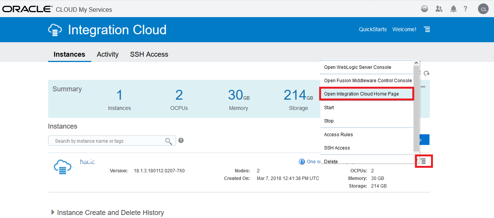

# 오라클 클라우드 테스트 드라이브 #
-----
## 301 : Oracle Integration Cloud Service 둘러보기 ##

### 소개 ###
이번 실습에서는 다음 작업을 수행해 보는 과정입니다.
- Oracle Integration Cloud Service의 웹기반 콘솔을 둘러봅니다.

### 본 실습은... ###
이번 실습에서는 다음을 수행합니다.
- 웹 기반 통합 클라우드 서비스 (ICS) 콘솔이 익숙해지도록 둘러보고, 앞선 실습상의 응용 프로그램 개발 방식과는 어떻게 다른 지 경험하고자 합니다.

### 준비사항 ###

- 통합 클라우드 서비스를 포함한 Oracle Public Cloud Service 계정 (없는 경우 강사와 확인)

### Oracle Integration Cloud Service 탐색 ###

1. [https://cloud.oracle.com/sign-in](https://cloud.oracle.com/sign-in)에 로그인을 하고, 데이터 센터를 선택하고, identity domain을 입력한후 비밀번호를 입력합니다.

성공적으로 로그인을 한 후에 서비스 제목에서 **Integration Cloud** 를 찾은 후 옆에 있는 햄버거 아이콘을 클릭합니다. 드랍다운 메뉴중에 `Open Service Console`를 선택합니다.

2. **Integration Cloud** 가 보이지 않는다면, 브라우저의 오른쪽 코너에 있는 `Customize Dashboard` 버튼을 클릭하면 나타나는  **Customize Dashboard** 다이얼로그 화면에서 Integration 부분에 `Show`를 선택하시면 됩니다.

3. Integration Cloud 대쉬보드 화면이 보이면, hamburger icon을 클릭한 후 `Open Integration Cloud Home Page`을 선택합니다.

3. 서비스 콘솔이 열리면 OIC home page 가 아래와 같이 보이게 됩니다.

4. 메인 화면의 왼쪽에 있는 `Integrations` 을 클릭합니다.

  \*화면 아래에 있는 `그만보기(Got it!)`를 클릭하여 **Guide Me** Quick Tour 를 없앱니다. 랩도중에는 필요가 없습니다.

5. 이 페이지에서는 Oracle Integration Cloud Service: Integrations, Connections, Lookups, Packages, Agents, Adapters and Libraries 를 사용할 수 있는 Link를 제공합니다.

6. 네비게이션 판넬을 사용하기 위해, 왼쪽 위에 있는 를 클릭하세요.

Navigation 판넬 은 Oracle Integration Cloud의 모든 개발기능에 접근 가능하게 해줍니다.

[Proceed to Next - 302 : CRM 연동을 위한 선 통합(Pre-Built) 자산 임포트 및 연결 정보 수정하기](302-IntegrationsLab.md)

or

[Back to Integrations Lab Home](README.md)
