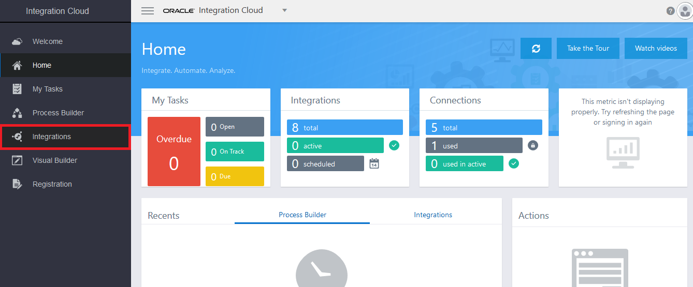

# 오라클 클라우드 테스트 드라이브 #
-----
## 302 : CRM 연동을 위한 선 통합(Pre-Built) 자산 임포트 및 연결 정보 수정하기 ##

### 소개 ###
이번 실습에서는 다음 작업을 수행해 보는 과정입니다.
- SOAP기반 CRM 서비스 호출하기
- REST 형식으로 서비스 노출하기

### 본 실습은... ###
이번 실습에서는 다음을 수행합니다.
- 웹 기반 클릭 및 구성 기술을 사용하여 ICS 연결 리소스를 가져오고 정의합니다. **SOAP** Connection 및 **REST** Connection.

### 준비사항 ###

- 통합 클라우드 서비스를 포함한 Oracle Public Cloud Service 계정 (없는 경우 강사와 확인)
- 강사가 배포 한 `XXX_ICS_INTMGT_01_lab.iar`의 통합 아카이브 파일 (IAR) 이름

### 선 통합(Pre-Built) 자산 임포트 ###

1. `통합(Integrations)` 파란색 아이콘을 클릭하여 **통합(Integrations)** 페이지로 이동합니다.

	

	또는 왼쪽 상단 모서리에 있는 햄버거 아이콘을 클릭하고 `설계자(Designer)`를 클릭한 다음 `통합(Integrations) `을 클릭하여 **통합(Integrations)** 페이지로 이동합니다.

	

	

	

2. 오른쪽 상단의 `임포트(Import)`를 클릭하면 **임포트(Import)** 대화 상자 창이 나타납니다. `Choose File` 버튼을 클릭합니다.

3. 컴퓨터 로컬 디렉토리를 찾아서 이전에 강사가 제공 한 *`XXX_ICS_INTMGT_01_lab.iar`의 통합 아카이브 파일 (IAR)* 파일을 선택한 다음 `임포트` 버튼을 클릭하십시오.

4. 통합 목록에 임포트한 통합(Integration)인 XXX_ICS_INTMGT (1.0)이 보입니다. 부분적으로 사전 빌드된 아티팩트 세트를 가져 왔습니다. 우리는 이미 만들어 진 것은 그대로 사용하고, 나머지 부분을 완성 할 것입니다.

### SOAP기반 CRM 서비스 호출하기 위한 SOAP 연결 정의 ###

1. 왼쪽 상단 모서리에 있는 햄버거 아이콘을 클릭하여 **연결(Connection)** 페이지로 이동하여 `설계자(Designer)`와 `연결(Connections)`을 차례로 클릭하십시오.

2. **연결(Connections)** 홈 페이지에서 **XXX_CRM_CustomerService** 및 **XXX_ICSINTMGT_ProcessOffer**라는 새로 가져온 연결(Connection) 각각 찾을 수 있어야 합니다.

3. 그런 다음 **XXX_CRM_CustomerService** Connection 행에서 오른쪽에 있는 햄버거 메뉴 아이콘을 클릭하고 아래의 `편집(Edit)`을 선택하십시오.

4. **XXX_CRM_CustomerService** 연결 세부 사항 페이지가 표시됩니다. 명시된 바와 같이, 이것은 SOAP 프로토콜 기반으로 연결합니다.이 연결 세부 사항을 정의 할 것입니다.

5. 아래로 스크롤하여 **접속 속성** 섹션을 열고 `접속 구성(Configure Connectivity)`버튼을 클릭하십시오.

6. **접속 속성** 대화 상자 창이 표시됩니다.**WSDL URL**에 **Property Value**를 다음 형식으로 제공하여 채웁니다.
	+ WSDL URL: **http://\<Your Java Cloud Service Instance IP Address\>/crm/CustomerServicePort?WSDL**
	+ 나머지 항목들은 빈 칸 그대로 둡니다.

7. 다른 속성 설정은 변경하지 마십시오. 변경 사항을 저장하려면 `확인`버튼을 클릭하십시오. 대상 서비스가 보안을 요구하지 않기 때문에 `보안 정책: No Security Policy`을 선택됩니다.

8. **SOAP Connection** 페이지의 맨 위에서 오른쪽 상단의 `테스트`를 클릭하면 테스트 **확인** 대화 상자 창이 표시됩니다. `검증 및 테스트(Validate and Test)`을 클릭합니다.

9. 연결 테스트가 성공하면 상단에 녹색 대화 상자 텍스트가 나타납니다.

10. 그런 다음 오른쪽 상단에서 `저장`을 클릭하십시오.

11. **변경 사항을 저장 하시겠습니까?** 대화 상자 창이 나타납니다. `저장`을 클릭하십시오.

12. **접속이 성공적으로 저장되었습니다**라는 결과를 확인하고 우측 상단의 `닫기`를 클릭하여 종료하고 **연결** 요약 페이지로 돌아갑니다.

13. CRM 고객 서비스에 대한 **SOAP 연결이 업데이트** 되었고 이제 호출 할 준비가되었습니다.

### ICS 서비스 노출을 위한 REST 연결 정의 ###

1. 그 다음으로 **XXX_ICSINTMGT_ProcessOffer** 연결을 업데이트 할 것입니다. 그러나 이번 Connection은 타 시스템을 **호출(invoke)** 하는 것이 아니라 대신 클라이언트, 즉 모바일 클라이언트에 의해 호출되는 연결 서비스입니다. 모바일 클라이언트 요청을 수신하는, 즉 **트리거** 되는 연결입니다.

2. **XXX_ICSINTMGT_ProcessOffer** Connection 행에서 오른쪽에 있는 햄버거 메뉴 아이콘을 클릭하고 아래의 `편집(Edit)`을 선택하십시오.

3. 이번에 **XXX_ICSINTMGT_ProcessOffer** 연결 세부 정보 페이지가 표시되며 **REST 트리거** 유형 연결로 인해 더 간단합니다.

4. **REST Connection** 페이지에서 오른쪽 상단 모서리에있는 `Test`를 클릭하십시오. **연결 테스트가 성공적으로 완료되었습니다**는 상단의 메시지를 확인합니다.

5. 그런 다음 오른쪽 상단에서 `저장`을 클릭하십시오. 마찬가지로 **변경 사항 저장?** 대화 상자가 뜨면 `저장`을 클릭하여 확인한 다음 대화 상자를 다시 닫습니다.

6. **연결 테스트가 성공적으로 완료되었습니다**는 상단의 메시지를 확인합니다. `닫기`를 클릭하여 종료하고 **연결** 요약 페이지로 돌아갑니다.

7. 두 개의 **연결**이 준비되었습니다. `SOAP 연결(CRM 고객 서비스 호출용)` 및 `REST 연결(모바일 클라이언트 요청 수신용)`이 준비되었습니다.

[Proceed to Next - 303 : 조정(Orchestration) 패턴을 이용하여 통합하기](303-IntegrationsLab.md)

or

[Back to Integrations Lab Home](README.md)
