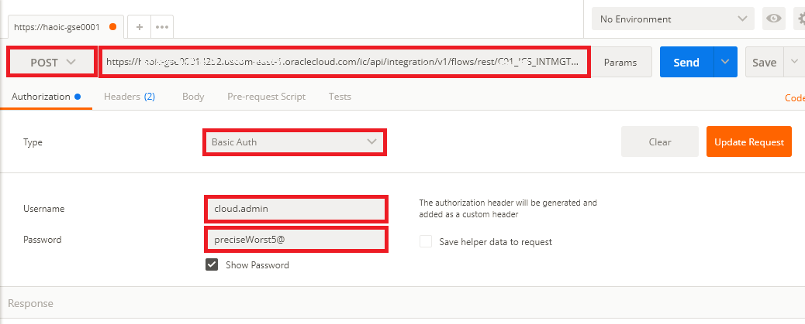
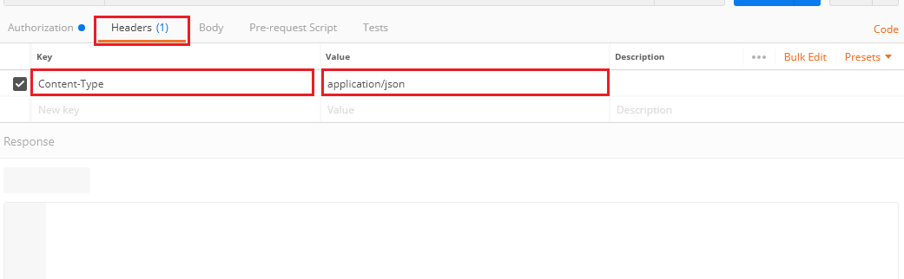
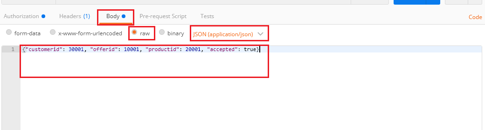
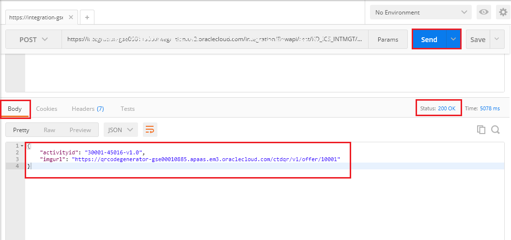

# 오라클 클라우드 테스트 드라이브 #
-----
## 304 : 서비스 테스트 및 ICS 대시 보드로 모니터링 ##

### 소개 ###
이번 실습에서는 다음 작업을 수행해 보는 과정입니다.
- ICS (통합 클라우드 서비스)가 제공하는 서비스 사용하기 및 모니터링

### 본 실습은... ###
이번 실습에서는 다음을 수행합니다.
- 이전 실습에서 생성한 조정(Orchestration) 서비스를 REST 서비스로 호출 테스트
- 테스트 결과를 ICS 모니터링에서 확인합니다.

### 준비사항 ###

- 통합 클라우드 서비스를 포함한 Oracle Public Cloud Service 계정 (없는 경우 강사와 확인)
- 이미 구성된 ICS의 SOAP 및 REST 연결
- 이전 실습에서 완료한 조정(Orchestration)

### 통합(Integration) 테스트 및 모니터링

1. 이전 실습을 통해 클라이언트에게 REST/JSON 방식으로 요청을 수신하고, CRM 고객 서비스로 라우팅 한 다음 다시 클라이언트에게 응답하는 통합을 성공적으로 배치했습니다. 이제 실제 호출 테스트를 해보고 그 결과를 모니터링 해봅니다. 테스트 위해 크롬 브라우저와 REST Client가 필요합니다. 크롬 브라우저가 없는 경우 설치하고, 다음 링크를 통해 REST Client를 설치합니다. [크롬 앱 - Postman 설치](https://chrome.google.com/webstore/detail/postman/fhbjgbiflinjbdggehcddcbncdddomop)

2. Postman에서 다음 정보를 입력합니다.
  - HTTP 메소드 드롭 다운 목록에서 **POST**를 선택하십시오.
  - **요청 URL 입력**텍스트 상자에 URL을 입력하십시오.
  `https://integration-<Your ICS Identity Domain>.integration.us2.oraclecloud.com/integration/flowapi/rest/<Your Integration Service Name>/v01/processoffer`
  - **Authorization** 탭 : 드롭 다운 목록에서 기본 인증을 선택하고 ICS 사용자 이름과 비밀번호를 각각 입력하십시오.
  

3. **헤더** 탭으로 이동하십시오. **Key**아래에 `Content-Type`을 입력하고 **Value** 아래에는`application/json`을 입력하십시오.

4. **Body** 탭: body 형식으로 raw, JSON (application/json)을 유형으로 선택하고 본문 텍스트를 다음 중 하나로 입력하십시오 :
  - Test 1: `{"customerid": 30001, "offerid": 10001, "productid": 20001, "accepted": true}`
  - Test 2: `{"customerid": 30002, "offerid": 10002, "productid": 20002, "accepted": false}`
  - (\*주의 : 위의 테스트는 실제 데이터를 사용하지 않고 단지 ICS에서 API의 가용성을 테스트하는 것을 목표로합니다)

5. `Send` 버튼을 클릭하여 요청을 실행하면 아래의 `200 OK`상태와 응답 본문 내용이 수신됩니다.

6. ICS로 돌아가서 왼쪽 상단에있는 햄버거 메뉴 아이콘을 클릭 한 다음 `모니터링`을 클릭하십시오.

7. 기본적으로 ICS 모니터링 **대시 보드**가 표시됩니다. 대시 보드는 통합 모니터링에 중요한 ICS 트래픽 상태 / 연결, 통합, 성공, 실패 및 기타 정보를 요약합니다.

8. `MONITORING` 아래에서 `Integrations`를 클릭하면, 이전에 실행된 최근 테스트 메시지를 볼 수 있습니다. 이제 오른쪽에 있는 `메시지 보기(View Messages)` 아이콘을 클릭하십시오.

9. 특정 통합을 위한 **인스턴스 추적** 창이 표시됩니다. 테스트 된 인스턴스 중 하나를 클릭하십시오

10. 특정 메시지 트랜잭션의 플로우 인스턴스가 표시됩니다. 플로우 인스턴스 전체의 녹색 경로는 통과하는 메시지의 정상 / 성공 흐름을 표시합니다. 우측 상단의 햄버거 메뉴를 클릭하고, `비즈니스 식별자`를 클릭합니다.

11. `비즈니스 식별자`대화 상자가 표시됩니다. 이 특정 메시지의`customerid`,`offerid` 및 `productid`의 값이 로그됨을 주목하십시오. 확인 후 창을 닫습니다.

12. 오른쪽 상단에있는 햄버거 메뉴 아이콘을 클릭하고 `감사 추적보기`를 클릭하십시오. 통합 플로우 대화 상자 창에 의해 실행 된 전체 활동의 **감사 추적**이 표시됩니다. `확인`버튼을 클릭하고 `닫기`를 클릭하십시오.

13. 마지막으로, 다음 실습 과제로 진행하기 전에 통합 클라우드 서비스에서 사인 아웃합니다. 본 서로 다른 실습 환경(도메인)을 사용하기 때문에 사인 아웃이 필요합니다.

14. `확인`버튼을 클릭하여 사인 아웃합니다.

[Back to Integrations Lab Home](README.md)
