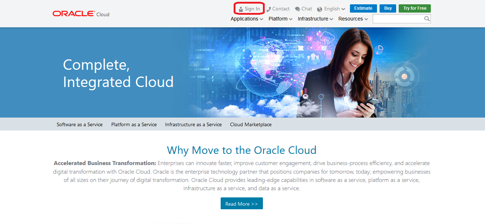
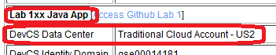
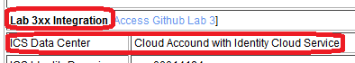
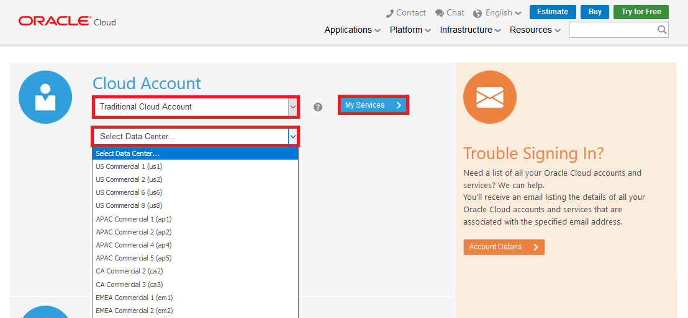
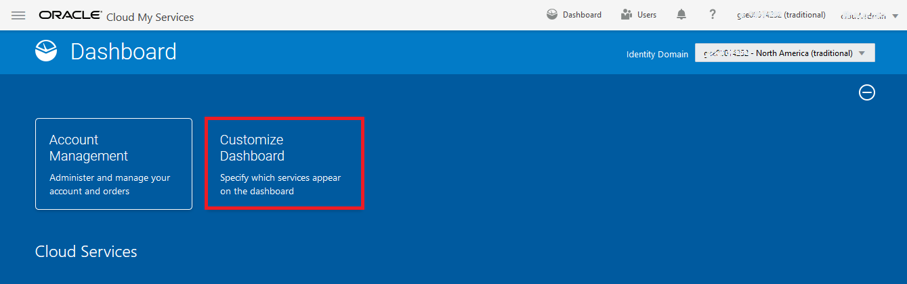
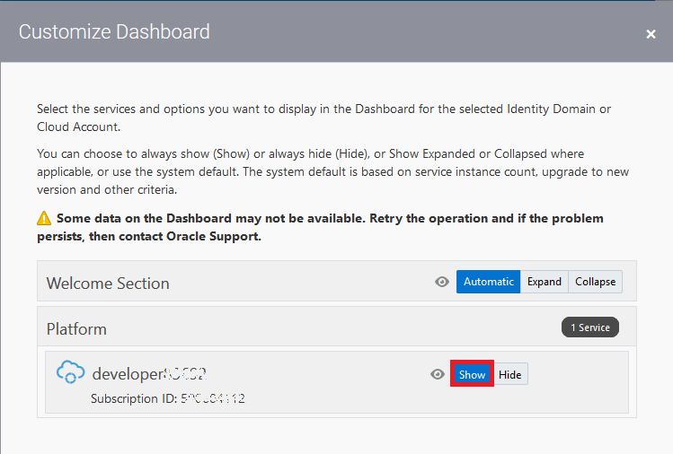
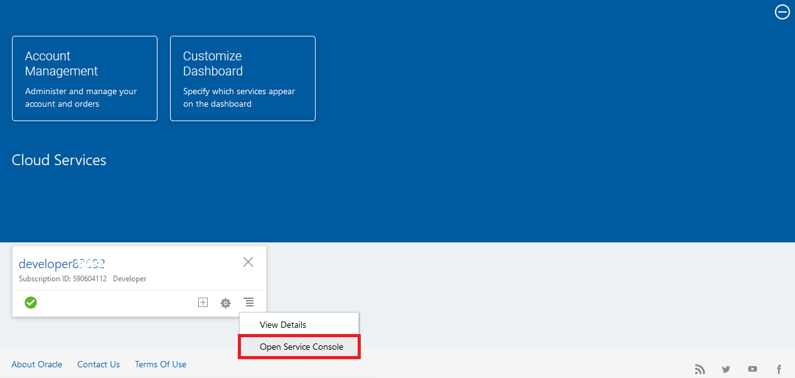
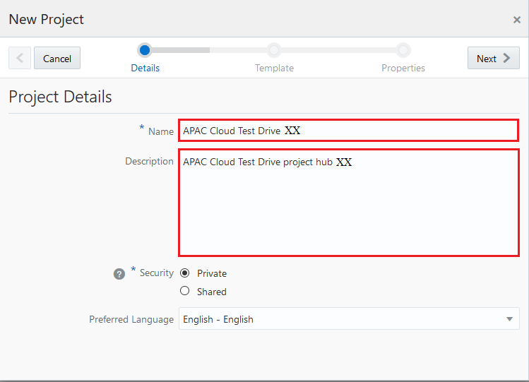

# 오라클 클라우드 테스트 드라이브 #
-----
## 101 : 초기 GitHub 저장소를 사용하여 Oracle Developer Cloud Service 로열티 관리 애플리케이션 프로젝트 생성 ##

### 소개 ###
이 튜토리얼에서는 다음 작업을 수행하는 방법을 보여줍니다. 
- 기존 외부 Git 저장소를 사용하여 Oracle Developer Cloud Service 프로젝트 생성 - GitHub 

### Practice 설명 ###
이 Lab에서는 다음을 수행합니다. 
- 로열티 관리 시스템을 위한 새로운 개발자 클라우드 서비스 프로젝트 만들기 
- 로열티 관리 Java 응용 프로그램 소스 코드를 저장할 새로운 Developer Cloud Service Git 저장소 만들기 
- Gitub에 저장된 외부 Git 저장소를 위에서 작성한 Developer Cloud Service Git 저장소에 복제합니다. 

### 준비사항 ###

- Developer 클라우드 서비스를 포함한 Oracle Public Cloud Service 계정 (없는 경우 강사에게 확인) 

----

#### Oracle Cloud에 로그인하십시오. 

1. 브라우저를 열고 [cloud.oracle.com](https://cloud.oracle.com)으로 이동하십시오. **로그인**을 클릭하십시오. 

2. 강사가 제공하는 랩 문서를 따라하시기 바랍니다. Lab 섹션별로 다음과 같이 해당 데이터 센터 정보를 다르게 사용해야 합니다.
  
or  
  

첫번째 Lab 1xx - Java App에서는 DevCS에 Login을 해야 합니다. 
`Traditional Cloud Account`,를 선택한 후   
    `US Commercial 2 (us2)` 를 선택하세요.  
여러분의 데이터센터의 환경에 따라서 선택하시면 됩니다.  **My Services** 버튼을 클릭하세요..

3. **Developer Cloud Service \(DevCS\)** 의 identity domain 정보를 입력하고 **Go** 를 클릭합니다.. Identity domain 과 비밀번호는 강사에게 문의하시기 바랍니다.

4. Service Administrator을 갖고 있는 DevCS username 과 password 를 입력하고  **Sign In** 을 클릭하세요.

5. 성공적으로 로그인을 하고 난 후에는 아래와 같은 대쉬보드를 볼 수 있습니다.
대시 보드에는 다양한 서비스에 대해 미리 정의 된 타일이 있습니다. **Developer Cloud Service** 타일이 나타나지 않으면 **Customize Dashboard **를 클릭하고 **developer xxx** 서비스를 표시하여 대시 보드에 표시하십시오.

#### Oracle Developer Cloud Service project 생성 ####

6. 이제, Developer Service 제목을 찾고 햄버거 모양의 아이콘을 클릭하십시오.dropdown 메뉴에서 **Open Service Console** 를 선택하십시오.

7. Oracle Developer Cloud Service에 로그인을 한 후 new project를 생성 합니다.

8. 프로젝트 이름과 설명을 입력하세요.
	**Name:** `APAC Cloud Test Drive XX` (XX - Use your assigned ID, e.g. 01)  
	**Description:** `APAC Cloud Test Drive project hub XX` (XX - Use your assigned ID, e.g. 01)  
	and click **Next**

9. 템플릿에서 *Empty Project* 선택하고 **Next** 를 클릭하세요.

10. Wiki Markup 으로 `MARKDOWN` 선택하고 **Finish** 를 클릭하세요.

11. Developer Cloud Service Project가 생성될 때 까지 잠시 대기하십시오.

12. 프로젝트가 준비 되면 프로젝트 기본 화면이 나타납니다. 오른쪽 창에서저장소탭에 있는지 확인하십시오. [+ **New Repository** ] 버튼을 클릭하여 새로운 Git 저장소를 만듭니다.

13. New Repository 에 다음 정보를 입력하세요.
   Name: `LoyaltyManagement`

   Initial content: `Import existing repository` 선택

   repository 주소로 `https://github.com/APACTestDrive/LoyaltyManagement.git` 를 복사해서 넣으세요.
   
[ **Create** ] 버튼을 클릭하세요.

14. 이제 기존 저장소를 기반으로 하는 개발자 클라우드 서비스에 저장된 소스 코드로 새로운 Git 저장소를 만들었습니다.

이 Lab 섹션을 마쳤습니다. 

[Procced to Next - 102: Define Continuous Integration 'Build' and 'Deploy' Configuration in Oracle Developer Cloud Service](102-JavaAppsLab.md)

or

[Back to JavaAppsLab Home](README.md)
