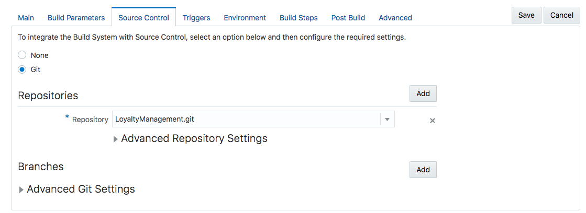
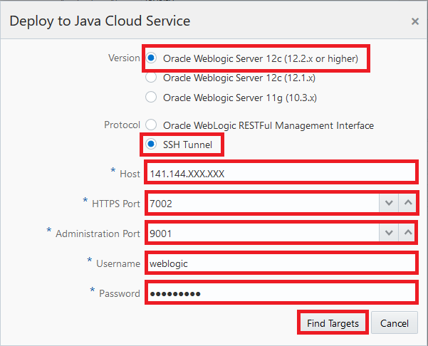
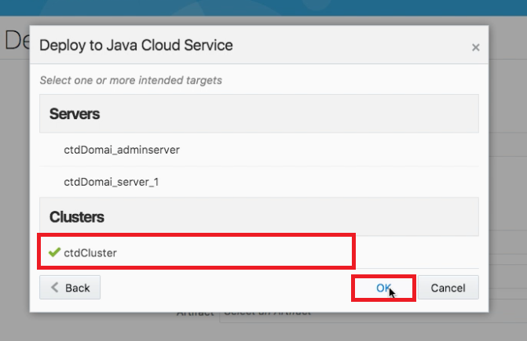

# 오라클 클라우드 테스트 드라이브 #
-----
## 102 : Oracle Developer Cloud Service에서 지속적인 통합 &#39;빌드&#39;및 &#39;배포&#39;구성 정의 ##

### 소개 ###
이 자습서에서는 다음 작업을 수행하는 방법을 보여줍니다. 
- Oracle 개발자 클라우드 서비스를 사용하여 로열티 관리 애플리케이션을 Java 클라우드 서비스에 배치 로열티 관리 애플리케이션은 마케팅 관리자가 오퍼 캠페인을 생성 할 수 있도록 간단한 JSP 페이지로 작성된 JEE 웹 애플리케이션입니다. 

### 오늘 Practice에 대하여 ###
이 연습에서는 다음을 수행합니다. 
- 충성도 관리를위한 빌드 작업 구성 - JEE 응용 프로그램 
- Java Cloud Service 구성 - Developer Cloud Service에 WebLogic Server 배포 
- 개발자 클라우드 서비스를 사용하여 충성도 관리 응용 프로그램 빌드 및 배포 

### 선수 과목 ###

Developer Cloud Service 및 Java Cloud Service를 포함한 Oracle Public Cloud Service 계정 
+ [Create Oracle Developer Cloud Service project for Loyalty Management JEE application](101-JavaAppsLab.md) 

----

#### 로열티 관리 응용 프로그램 빌드 작업 구성 ### 

1. 이전 연구실 101에서 프로젝트 준비가 완료되면 충성도 관리 - JEE 응용 프로그램을 Java 클라우드 서비스에 필요한 형식으로 컴파일하고 패키징하기위한 빌드 작업을 만들어 보겠습니다. 

2. 왼쪽 메뉴에서**Build**항목을 선택하고**New Job**버튼을 클릭하십시오. 

3. 새 작업에 대한 이름 *LoyaltyManagementBuild*를 입력하십시오.*자유 스타일 작업 만들기*옵션을 선택하고 저장하십시오. 새로 생성 된 작업의 주 구성 페이지에서 **Default (실행 환경의 기본 Java 버전)**가 선택된 JDK인지 확인하십시오. 

4. **소스 제어**탭으로 변경하고 **Git**를 선택하십시오. git의 속성 섹션에서 목록에 제공된 유일한 Git 저장소를 선택하십시오. 분기 섹션에서 목록에**마스터**옵션을 추가하고 선택하십시오. 이것은 **master**지점 버전 만 사용되도록하는 것입니다. 고급 설정 기본값을 그대로 둡니다. 

5. **트리거**탭을 클릭하여*SCM 폴링*을 구성하십시오.**SCM 폴링 일정에 따라**선택하십시오. 이렇게하면 소스 코드 저장소의 파일이 변경된 후 빌드가 시작됩니다. 

6. **빌드 단계**탭으로 변경하고**Maven 3**빌드 단계를 추가하십시오.**클린 설치**를 목표로,**loyalty/pom.xml**을 POM 파일 입력란에 입력하십시오. (Build Steps 탭에**Loading ...**이 표시되는 경우 오랜 시간 동안 Build 구성을 저장 한 다음 다시 열고 계속하십시오.) 

7. 마지막으로 게시 빌드 탭으로 변경하고**이슈 보관**옵션을 선택하십시오.**loyalty/target/*.war**을 **아카이브 할 파일** 필드에 입력하십시오. 

8. **저장**을 클릭하여 새 작업 구성을 업데이트하십시오. 빌드 작업을 확인하려면 작업 세부 정보 페이지에서 **지금 빌드**를 클릭하십시오. 작업이 완료되면 아카이브 된 아티팩트를 확인하십시오. 그것은 다음과 같아야한다 :`loyalty.war` 

빌드 작업에는 마스터  관리 웹 응용 프로그램 소스 아티팩트를 JEE 웹 응용 프로그램 아카이브 (WAR) 파일 loyalty.war로 압축하는 추가 빌드 단계가 포함되어 있습니다. 이 아카이브는 JCS에 Java 웹 응용 프로그램을 배포하는 데 필요한 형식입니다. 

#### Java Cloud 서비스 배치 구성 

9. 이제 성공적인 빌드 작업 후에 Java Cloud Service에 직접 배치 할 수있는 배치 구성을 작성하십시오. DevCS에서**Deploy**페이지로 변경하고**새 구성**을 작성하십시오. 

10. 다음 등록 정보를 설정하십시오. 

- **구성 이름**: 배포 구성을 식별하는 모든 이름 - 우리는 **loyalty**를 사용합니다. 
- **응용 프로그램 이름**: JCS의 응용 프로그램 이름입니다. 애플리케이션의 URL 컨텍스트 경로가 결정되므로**loyalty**를 사용합니다. 
- **Deployment Target**:** New**를 클릭하고 Java Cloud Service를 선택하고**Version**,**Protocol**,**Host**,**HTTPS Port**및**신임장**. [(Find out the Java Cloud Service Host and HTTPS Port.)](java.cloud.md). 
Java Cloud Service - WebLogic Admin 사용자 이름 및 비밀번호 (예 : 각각 &#39;weblogic&#39;및 &#39;Welcome_1&#39;) 또는 강사가 별도로 제공합니다. 
- **유형**:** 자동**을 선택합니다. 이는 빌드 작업의 성공적인 실행 후 자동 배치를 의미합니다. 이전에 작성한 작업 및 이슈를 선택하여 배치하십시오. 
- **Job**:** LoyaltyManagementBuild**빌드 단계는이 랩의 초기 단계에서 정의됩니다. 
- **Arifact**:** loyalty/target/loyalty.war**, **Job**을 선택한 후에 사용할 수있는 유일한 옵션입니다. 

   
인증서 경고가 표시되면**&#39;이 JCS 인스턴스에 연결할 때이 인증서 수락&#39;을 선택하고 [**확인**]을 클릭하십시오. 

   
****ctdCluster`를 확인하고 [**OK**]를 클릭하여 Java Cloud Service 클러스터에 응용 프로그램을 배포하십시오 

11. **저장**을 클릭하십시오. 

#### 로열티 관리 응용 프로그램 빌드 및 배포 

12. 이제 Java Cloud Service에 대한 배치를 시작하려면 두 가지 옵션이 있습니다. 새로 생성 된 배포 구성을 사용하여 배포 프로세스를 시작할 수 있습니다. 톱니 바퀴 아이콘을 클릭하고**시작**을 선택합니다. 

13. 다른 옵션은 성공적인 빌드 후에 이슈를 배포 할 새로운 빌드 작업 실행을 시작하는 것입니다.**빌드**페이지로 돌아가서 렌치 아이콘을 클릭하면 로열티 관리 애플리케이션 빌드 작업에 속하게됩니다. 

 

14. JUST 응용 프로그램을 Java Cloud Service에 배포합니다.**배포**페이지에서 배포 결과를 확인할 수 있습니다. 배포가 준비되면 (다소 시간이 걸릴 수 있습니다)**Deploy to JCS**링크를 클릭하십시오. 

15. 그러면 WebLogic Server 관리 콘솔이 열립니다. 제공된 WebLogic Admin 사용자 이름과 암호 (예 : 각각`weblogic` 및`Welcome_1`)로 로그인하십시오. 

"WebLogic Console")

16. 로그온 한 후 왼쪽 탐색 메뉴에서**Deployments**를 클릭하십시오. 귀하는 배치 요약 목록에서 귀하의 로열티 관리 응용 프로그램**loyalty**를보아야합니다. 

17. 로열티 관리 응용 프로그램 URL은 다음 형식이어야합니다.`https://**<JCS WLS instance IP Address>**/loyalty/jsp/welcome.jsp`, JCS WLS 인스턴스 IP 주소는 12 단계에서 DevCS의**Deploy to JCS**target과 동일합니다. 

18. 이 배포 프로세스를 트리거하는 다른 많은 옵션이 있습니다. 예를 들어 빌드는 소스 변경에 의해 트리거되거나 특정 시간대로 스케줄 될 수 있습니다. 

이 Lab 섹션을 마쳤습니다. 

[Procced to Next - 103: Continuous Integration & Delivery (CICD): Using Brackets, Commit and Push Code Changes to Oracle Developer Cloud Service](103-JavaAppsLab.md)

or

[Back to JavaAppsLab Home](README.md)

