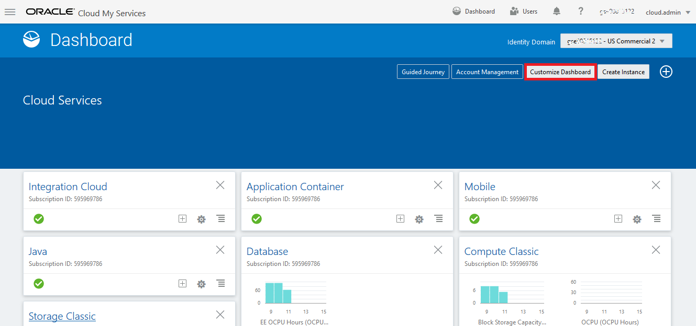

# ORACLE Cloud-Native DevOps workshop #
-----
## Oracle Cloud ##에 로그인하십시오.

1. 브라우저를 열고 [cloud.oracle.com](https://cloud.oracle.com)으로 이동하십시오.**로그인**을 클릭하십시오. 

2. 데이터 센터를 선택하고**내 서비스**를 클릭하십시오. 

3. ID 도메인을 입력하고**이동**을 클릭하십시오. 

4. 서비스 관리자 역할을 가진 사용자의 사용자 이름과 암호를 입력하십시오.**로그인**을 클릭하십시오. 

5. 대시 보드에는 서비스별로 미리 정의 된 타일이 있습니다. 서비스에 대한 바로 가기가 표시되지 않으면**대시 보드 사용자 지정**을 클릭하고 대시 보드에 표시 할 서비스를 표시합니다. 

[Back to JavaAppLab Home](README.md) 

