# 오라클 클라우드 테스트 드라이브 #
-----
## 401 : MBE 패키지 가져 오기 및 외부 서비스 용 커넥터 구성

### 소개 ###

커넥터를 사용하면 백엔드 시스템 (예 : 엔터프라이즈 미들웨어) 및 웹 서비스에 대한 액세스 단순화 및 표준화한 API를 작성할 수 있습니다. Oracle OMCe는 다양한 유형의 커넥터를 제공하여 REST 커넥터, SOAP 커넥터, OIC (Oracle Integration Cloud Service) 커넥터 및 Oracle Fusion Application 커넥터를 비롯한 여러 유형의 백엔드 시스템과의 통합을 단순화합니다. 이 실습에서는 REST 커넥터를 사용하여 마이크로 서비스와 integration labs에서 생성 한 세 가지의 REST service와 통합합니다. 

일단 커넥터가 생성되면 Custom API (예 : 나중에 작성할 Loyalty Mgmt APi)에서 사용할 수 있으며 모바일 응용 프로그램에서 사용할 수 있습니다. 

### 오늘 Exercise에 대하여 ###
이 실습에서 3 개의 커넥터를 생성 할 것입니다. 그 중 2 개는 ACCS의 마이크로 서비스와 연결되어 query 오퍼 혹은 QR 코드를 생성하는데 사용되며, 다른 한개의 커넥터는 ICS의 서비스와 연결되어 query를 수락하거나 거절하고 기존 CRM을 업데이트합니다. 

위의 3 커넥터를 만들려면 다음을 수행하십시오. 
- 사용할 Custom API, 모바일 백엔드와 세개의 커넥터를 포함하고 있는 MBE 패키지를 import합니다. 
- 백엔드 서비스와 통합하기 위해 올바른 URL과 권한 정보를 사용해서 커넥터를 구성하십시오. 
- &quot;Process Offer&quot;커넥터를 이용해서 커넥터의 결과를 테스트하고 검증하십시오. 

### Prerequisites ###

- 이 랩에서 사용하게 될 서비스를 제공받기 위해, ACCS 및 ICS에서 `마이크로 서비스`및 `Integration`랩을 완료했습니다. 

#### MBE 패키지 가져 오기 

또는 강사가 제공 한 액세스 문서에서 제공되는 모바일 클라우드 URL에 액세스하여 1-6 단계를 무시할 수 있습니다

액세스 문서에 제공된 ID 클라우드 서비스 도메인 ID 및 자격증 명 클라우드 계정을 사용하여 모바일 클라우드에 로그인합니다.

1. 액세스 문서에 제공된 **Cloud Account with Identity Cloud Service** 도메인 ID 및 자격증 명 클라우드 계정을 사용하여 모바일 클라우드에 로그인합니다.

2. 대시 보드 화면에서 **Mobile** 타이틀 아래의 &quot;Open Service Console&quot;를 클릭하십시오. 
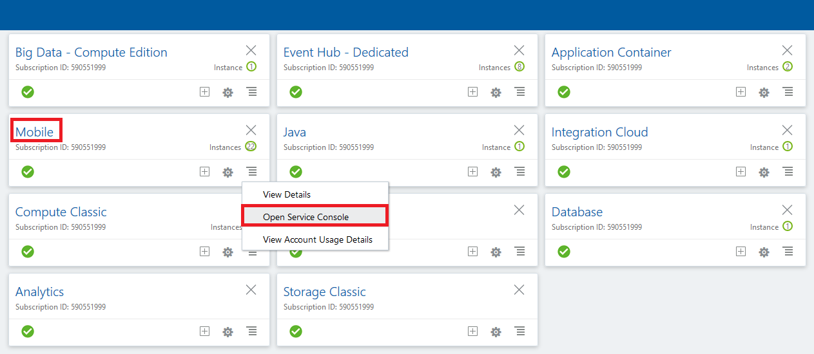

3. Oracle Cloud Stack 서비스 세부 사항 화면에서 Mobile Cloud의 이름을 클릭하십시오.
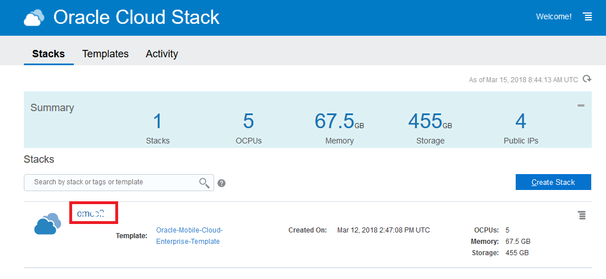

4. 선택된 모바일 클라우드의 `Stack Overview`목록에서 `CORE`로 이름이 끝나는 것을 클릭하십시오.
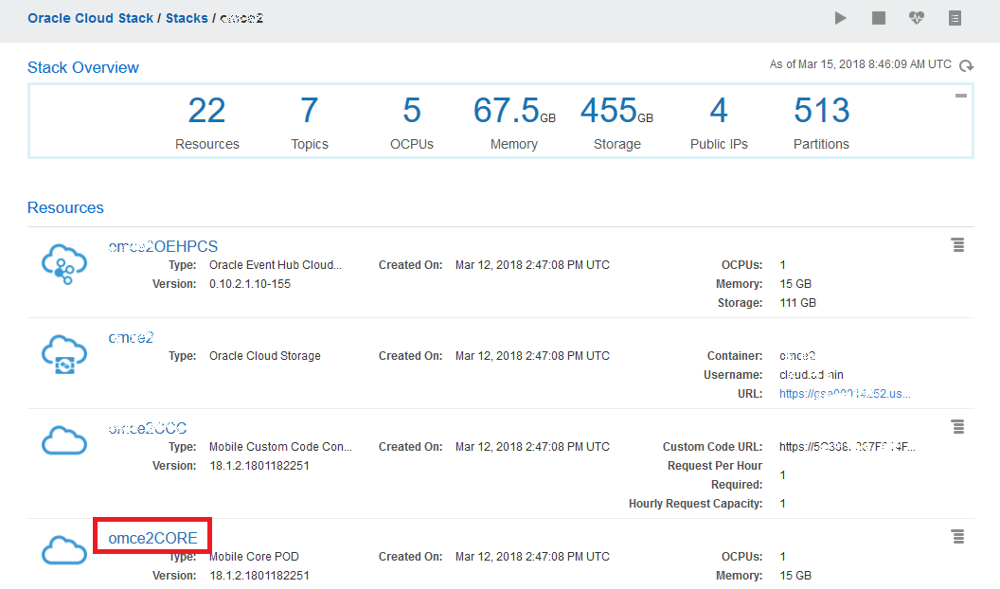

5. `xxxxxCORE` 세부 정보 페이지에서 `Load Balancer` 섹션을 찾아서 확장하고 URL을 복사하십시오.
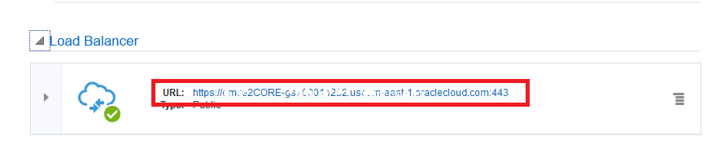

6. OMCe 포털 URL 형식은 다음과 같습니다. https://<위의 `Load Balancer` URL>/mobileui
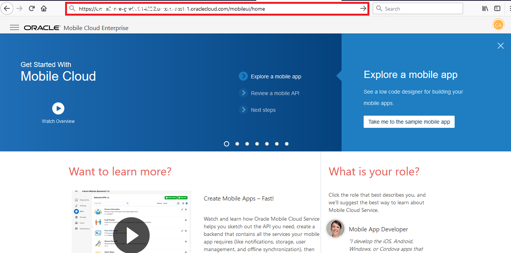

4. OMCe Portal에서 서비스 소개 페이지의 왼쪽 상단 모서리에있는 햄버거 아이콘을 클릭하십시오. 탐색 창에서 &quot;Applications&quot;-> &quot;Packages&quot;를 선택하고 &quot;New Import&quot;녹색 버튼을 클릭하십시오. 
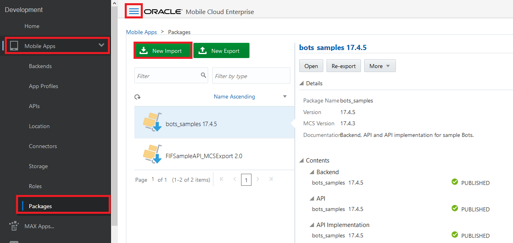

5. &quot;패키지 파일 선택&quot;을 클릭하고 정확한 접미사가 할당 된 MBE 패키지 파일 &quot;package-LoyaltyMgmt_MBE0X.zip&quot;을 선택하십시오. 

6. 파일이 업로드되면 `Next`을 클릭하십시오. 
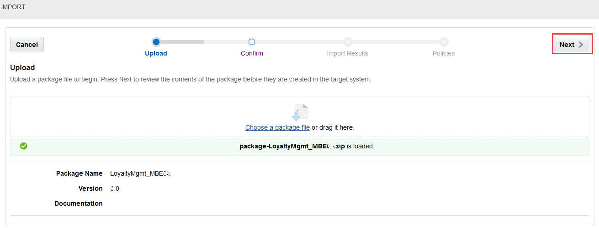

7. `confirm` 단계에서 패키지 내용이 표시 됩니다. 패키지에는 모바일 백엔드 `LoyaltyMgmt_MBE0X`, 클라이언트 `MyAndroidClient0X`, API `LoyaltyMgmt0X`, API 구현체 `LoyaltyMgmt0X`와 세개의 커넥터 `GenerateQRCode0X`, `ProcessOffer0X`, `QueryOffers0X`가 포함되어야 합니다. 가져올 각 개체에서 접미사가 올바른지 확인하십시오. `다음`을 클릭하십시오. 
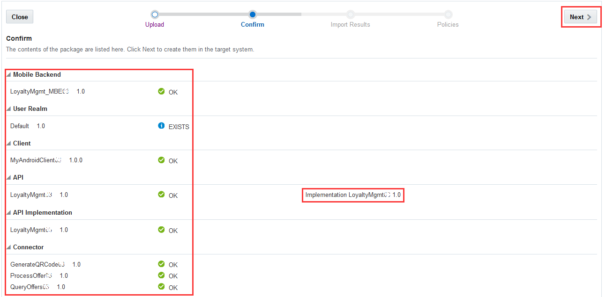

8. `Import Results`단계에서 이미 존재하는 사용자 영역 `Default`을 제외한 모든 객체가 성공적으로 가져 오기가 되었는지 확인하십시오. `Next`을 클릭하십시오. 
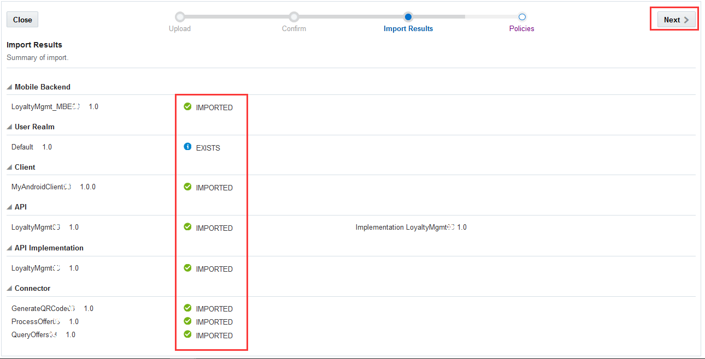

9. `Policies`단계에서 `*.connector/GenerateQRCode0X (1.0).Connector_Endpoint`정책을 선택하고 `편집(Edit)`을 클릭하십시오. 
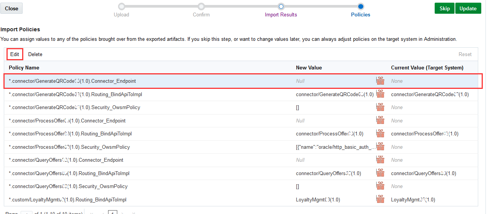

10. Tab키를 눌러 TextEdit 박스로 Focus를 이동한 후, ACCS에 배포 된 QR 코드 서비스의 호스트 URL로 사용자 정의 값을 설정합니다 (예 :`https://qrcodegenerator-<ACCS_DOMAIN_NAME>.apaas.<DATACENTER>.oraclecloud.com` `Save`을 클릭하십시오. 
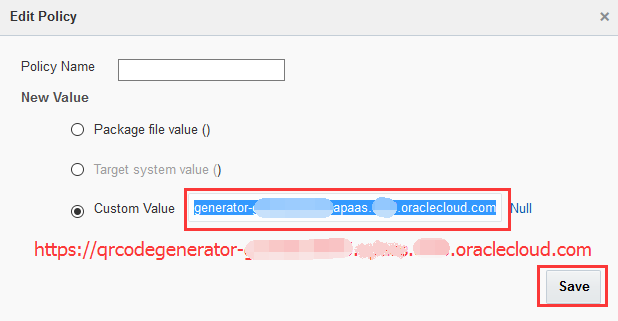

11. `Policies`단계로 돌아가서 `*.connector/ProcessOffer0X (1.0).Connector_Endpoint`정책을 선택하고 `편집`을 클릭하십시오. 
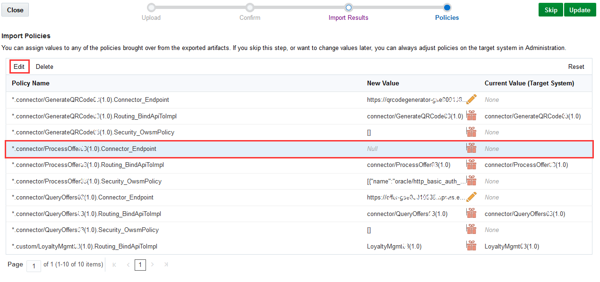

12. OIC에 배포 된 `Process Offer`서비스의 전체 서비스 URL로 사용자 정의 값을 설정하십시오 (예 
`https://<OIC_INSTANCE_NAME>-<OIC_DOMAIN_NAME>.<DATACENTER_LOCATION>.oraclecloud.com/ic/api/integration/v1/flows/rest/CXX_ICS_INTMGT/1.0/processoffer`
 `save`을 클릭하십시오. 
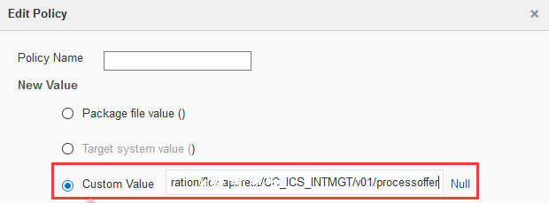

13. `Policies`단계로 돌아가서 `*.connector/QueryOffers0X (1.0).Connector_Endpoint`정책을 선택하고 `Edit`를 클릭하십시오. 
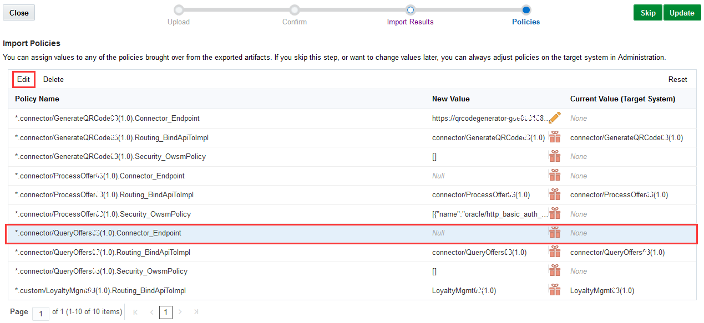

14. Tab키를 눌러 TextEdit 박스로 Focus를 이동한 후, JCS에 deploy된 offer 서비스의 호스트 URL로 사용자 정의 값을 설정합니다 (예 :`http://<IP Address of LoyaltyMgmt in #1 JavaApp Lab>`. `Save`을 클릭하십시오. 
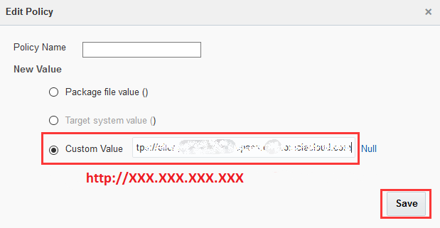

15. `Policies`단계로 돌아가서 세 가지 커넥터 끝점 정책에 대한 새 값을 성공적으로 설정했는지 확인하고 `update`를 클릭하여 패키지 가져 오기를 완료합니다. 
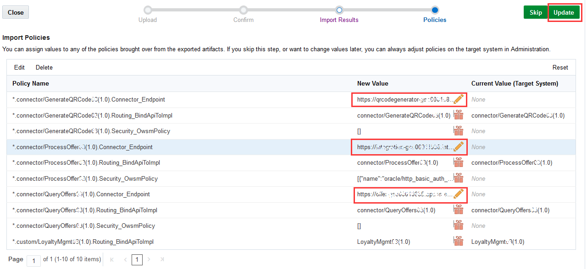

#### 'OIC에서 `Process Offer`서비스에 액세스하기위한 자격 증명 구성 
OIC에 배포 된 `Process Offer`서비스는 `Integrations`Lab에서 `Basic Authentication`을 사용하도록 구성됩니다. `Process Offer`서비스와 통합하려면 OMCe의 커넥터가 OIC의 `Process Offer`에 액세스 할 수 있도록 OMCe의 ICS 자격 증명을 구성해야합니다. 

1. 탐색 창에서 &quot;관리&quot;를 클릭하여 &quot;관리&quot;페이지를 엽니 다. 아래로 스크롤하여 &quot;키 및 인증서&quot;를 클릭하여 &quot;CSF 키 및 인증서&quot;상자를 엽니 다. 
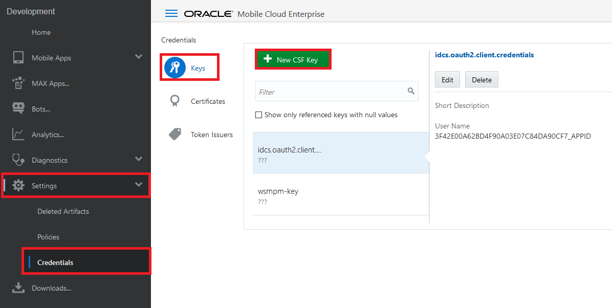

2. **New CSF Key** 영역에서 다음과 같이 입력하십시오:  
- **Key Name**: ICSXX (XX 는 사용자에게 지정된 접미사)
- **Short Description**: ICSXX (Same as above or meaningful description)
- **User Name**: username used for Integration Cloud
- **Password**: password used for Integration Cloud
- **Confirmed Password**: Same as above
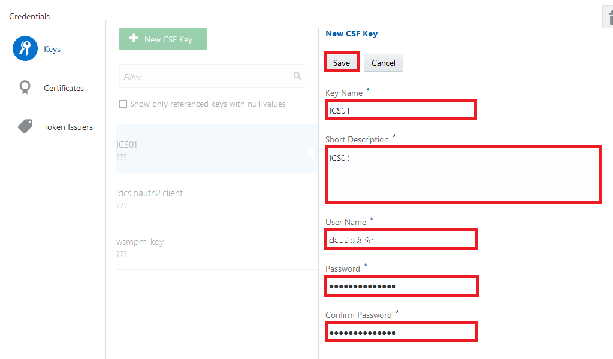
`Save` 버튼을 클릭하십시오.

3. 지정된 이름의 새 CSF 키가 자격 증명 목록에 표시됩니다.
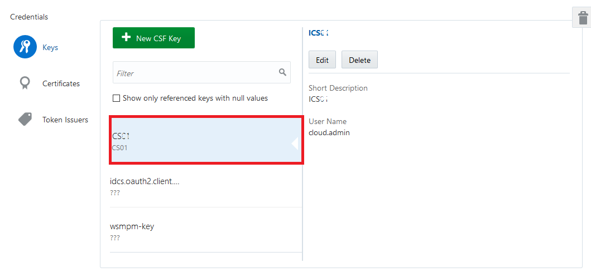

#### 커넥터 `Process Offer`테스트 

커넥터를 가져 와서 완전히 구성한 후에는 커넥터를 테스트 할 수 있습니다. 이 실습에서는 커넥터 `Process Offer`을 테스트합니다. 

1. 탐색 창에서 &quot;Applications&quot;-> &quot;Connectors&quot;를 선택하십시오. 작성한 커넥터를 검색하려면 &quot;0X&quot;(0X가 사용자에게 지정된 접미사)를 입력하십시오. &quot;Process Offer 0X&quot;(0X는 당신에게 할당 된 접미사)를 선택하고 &quot;Open&quot;을 클릭하십시오. 
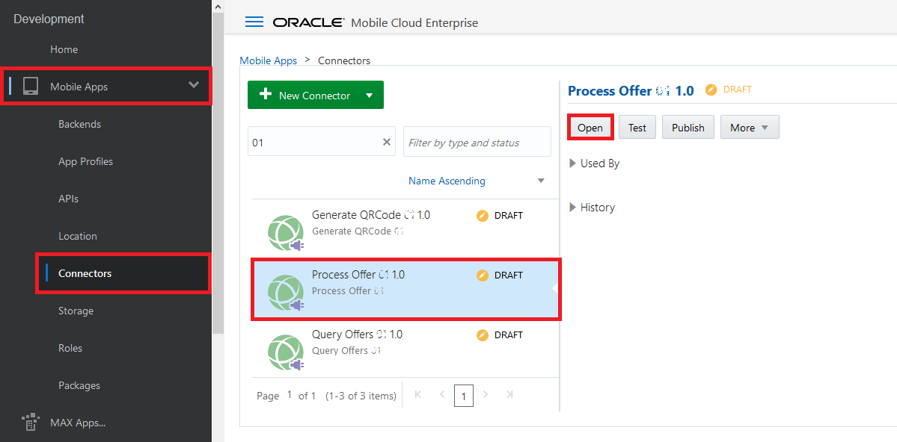

2. `General`단계에서 `API Name`이 `ProcessOffer0X`(0X는 지정된 접미사)로 설정되어 있는지 확인하고 `Next`을 클릭하십시오. 
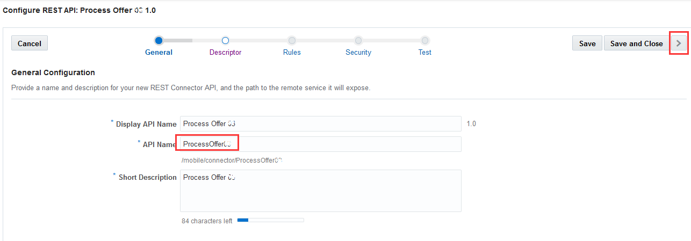

3. `Descriptor`단계에서 `Remote URL`이 ICS의 `Process Offer`서비스의 전체 서비스 URL로 설정되어 있는지 확인하십시오 (예 : `https://<OIC_INSTANCE_NAME>-<OIC_DOMAIN_NAME>.<DATACENTER_LOCATION>.oraclecloud.com/ic/api/integration/v1/flows/rest/CXX_ICS_INTMGT/1.0/processoffer` 를 참조하십시오. `다음`을 클릭하십시오. 
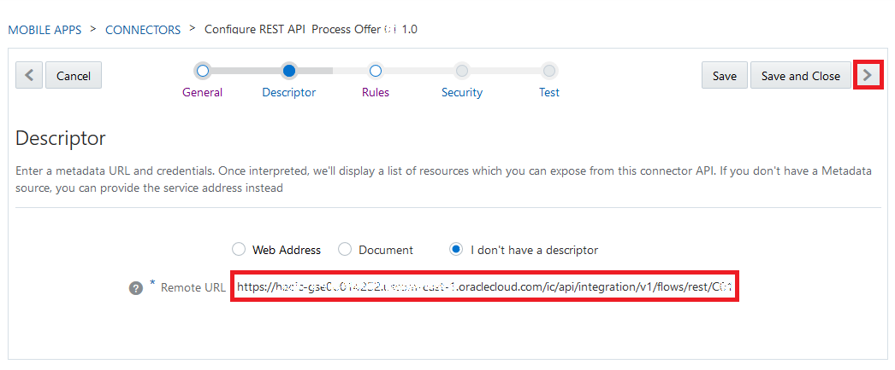

4. `Rules`단계에서 아무 규칙도 사용되지 않으므로 `Next`을 클릭하십시오. 

5. `Security`단계에서 보안 정책 &quot;oracle /http_basic_auth_over_ssl_client_policy&quot;가 선택되고 csf-key가 `ICS0X`(0X가 사용자에게 지정된 접미사)로 설정되어 있는지 확인하십시오. `Next`을 클릭하십시오. 
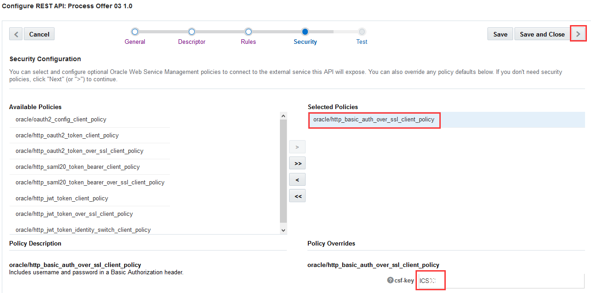

6. `Yes`를 클릭하여 저장하십시오. 

 

7. `Test`단계에서 HTTP 메소드로 `POST`를 선택하고 HTTP Body로 { &quot;customerid&quot;: 66890169, &quot;offerid&quot;: 10001, &quot;productid&quot;: 20001, &quot;accepted&quot;: false} 입력하세요

8. &quot;Authentication&quot;섹션의 드롭 다운 목록에서 만든 모바일 백엔드 (예 :`LoyaltyMgmt_MBE0X`)를 선택하고 &quot;Test Endpoint&quot;를 클릭하십시오. 
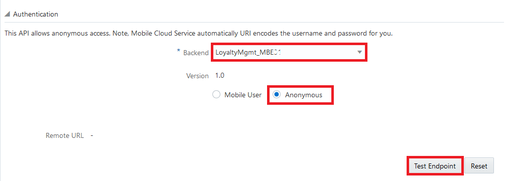

9. 페이지 하단에 HTTP 200 OK 응답이 표시되면 모든것이 완료된 것입니다. 

이 Lab을 성공적으로 마쳤습니다. 

[Procced to Next - 402: Verify and test custom APIs and implementation](402-MobileLab.md) 

또는 

[Back to Mobile Service and Application Home](README.md) 

