# 오라클 클라우드 테스트 드라이브 #
-----
## 403 : 푸시 알림 설정 및 모바일 앱 구성 ##

### 소개 ###
알림 서비스 (MCS 플랫폼 API의 일부)를 사용하여 모바일 백엔드에 등록 된 앱 사용자에게 알림을 보낼 수 있습니다. 모바일 백엔드에서 알림을 설정하면 iOS, Android 및 Windows 앱에서 알림을 보내는 프로세스가 동일합니다. 적절한 공급 업체 인증서를 획득하고 앱의 모바일 백엔드에 등록하여 알림을 설정합니다. 또한 모바일 앱에 자체 코드를 작성하여 푸시 알림을 처리 할 수 ​​있습니다. MCS는 푸시 알림 서비스를 다른 응용 프로그램에 노출하여 캠페인 관리 용 Java 응용 프로그램과 같은 응용 프로그램이 MCS가 제공하는 푸시 알림 서비스를 호출하여 최종 사용자에게 푸시 알림을 보낼 수 있습니다. 

### 오늘 Practice에 대하여 ###
이 연습에서는 다음을 수행합니다. 
- 알림 프로필 만들기 
- 모바일 백엔드에서 작동하도록 모바일 앱 구성 
- 시험 알림 

### Prerequisites ###

- Android Supremo 앱을 Android 기기에 설치했습니다. 

----
#### 알림 프로필 만들기 알림 프로필은 밀어 넣기 알림 공급자가 밀어 넣기 알림을 보내는 데 필요한 인증서를 정의합니다. 이 실습에서는 알림 프로필을 만들어이를 클라이언트 애플리케이션 (Cafe Supremo 모바일 애플리케이션)과 연결하여 MCS가 Cafe Supremo 모바일 애플리케이션에 푸시 알림을 보낼 수있게합니다. 

1. 탐색 창에서 &quot;응용 프로그램&quot;-> &quot;모바일 백엔드&quot;를 선택하십시오. 귀하가 가져온 모바일 백엔드를 검색하려면 &quot;0X&quot;(0X가 귀하에게 할당 된 접미사 임)를 입력하십시오. &quot;LoyaltyMgmt_MBE0X&quot;(0X가 귀하에게 지정된 접미사 임)를 선택하고 &quot;열기&quot;를 클릭하십시오. 
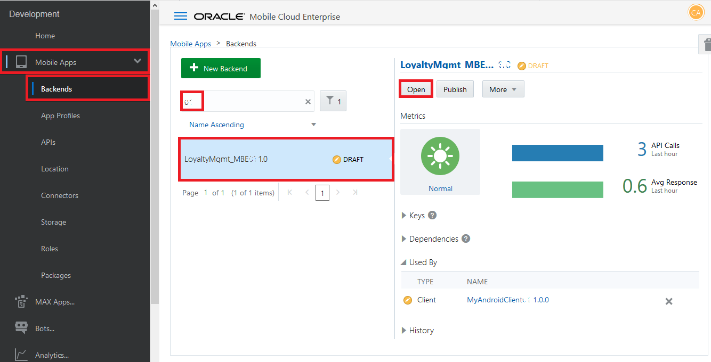

2. &quot;클라이언트&quot;탭으로 전환하면 &quot;MyAndroidClient0X&quot;(0X가 사용자에게 지정된 접미사 임)라는 클라이언트가 나타납니다. 클라이언트와 관련된 알림 프로필이 없습니다. &quot;MyAndroidClient0X&quot;클라이언트를 클릭하십시오. 
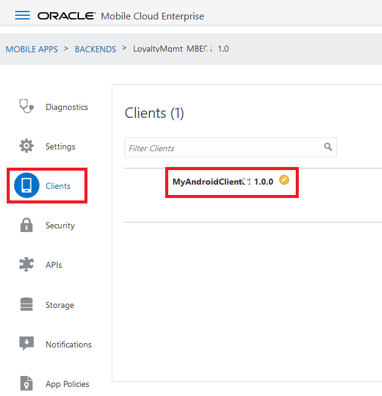

3. 클라이언트의 설정이 표시됩니다. 아래로 스크롤하여 클라이언트의 &quot;응용 프로그램 키&quot;를 확인하십시오. 
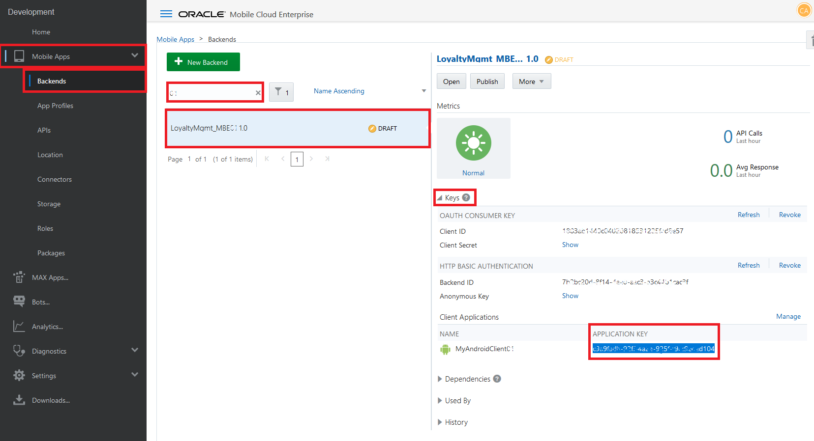

4. **&quot;응용 프로그램 키&quot;값을 복사하고 &quot;Mobile_App_Settings_Sample.json&quot;파일에서 &quot;applicationKey&quot;속성 값을 바꿉니다.**나중에 사용할 수 있도록 파일을 저장하십시오. 
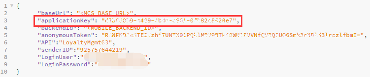

5. &quot;MyAndroidClient0X&quot;클라이언트의 &quot;프로필&quot;탭으로 전환하고 &quot;새 프로필&quot;단추를 클릭하여 알림 프로필을 만듭니다. 
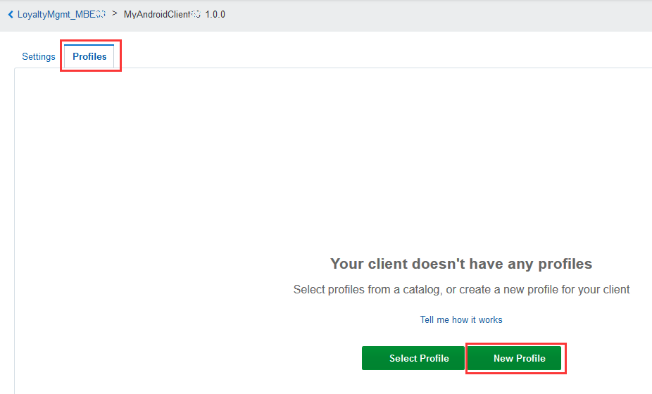

6. 이름으로 에는 `FCM0X` (0X가 사용자에게 지정된 접미사, e.g: 03)를 넣으세요. "API Key"로 `AAAA14t0nbs:APA91bHtR-V_lZEcMgaEFIJd_UrybuBjNyPG4N0ZoA33UqbZ9CywL_e2FnIfoS9lvPV5gut3Mm_ZMoex7PE1-YL-7ACaP3CnrDYpl8Qq3_jfsO3HMJYS-Mzr_X-xWpgdqWswVHsSUgDX`을 붙여넣고, "Sender ID"로  `925757644219`를 넣으세요. "Notification Service"로 `Google Messaging (GCM or FCM)`을 설정하고 "Send Method"는 `XMPP`, “Create”를 누르세요. (이것은 Google로 부터 받은 key 입니다.)

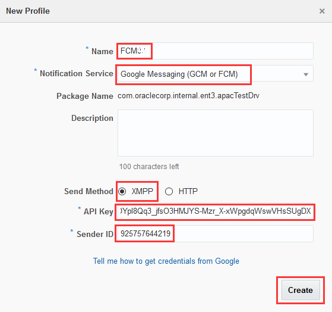 

7. 알림 프로필이 만들어져 클라이언트 &quot;MyAndroidClient0X&quot;와 연결되었습니다. 탐색 바의 &quot;&lt;LoyaltyMgmt_MBE0X&quot;링크를 클릭하여 모바일 백엔드로 돌아갑니다. 

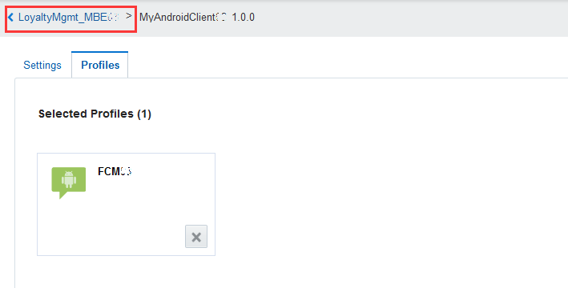

8. 클라이언트가 &quot;통지 사용&quot;인지 확인하십시오. 
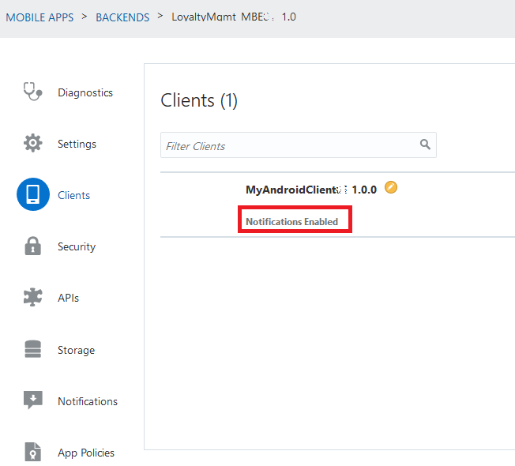

---
#### 모바일 백엔드에서 작동하도록 모바일 응용 프로그램 구성 모바일 백엔드와 함께 작동하도록 모바일 응용 프로그램을 구성해야 응용 프로그램에서 테스트를 수행 할 수 있습니다.**Mobile_App_Settings_Sample.json**파일을 사용하여 모바일 앱을 구성하는 데 필요한 설정을 수집합니다. 

1. 모바일 백엔드의 &quot;설정&quot;탭으로 전환하고 모바일 백엔드 설정에서 &quot;모바일 백엔드 ID&quot;, &quot;익명 키&quot;및 &quot;기본 URL&quot;의 값을 찾습니다. 
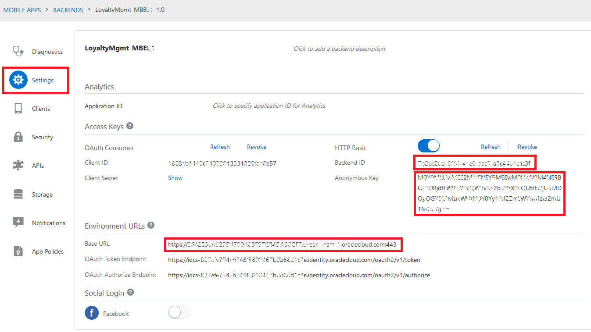

2. 모바일 백엔드 설정에서 값을 복사하고 &quot;Mobile_App_Settings_Sample.json&quot;파일의 대상 속성 값을 바꿉니다. 다음 속성을 복사하고 바꿔야합니다. 

| From Property in MBE Settings | To Property in JSON File |
|-------------------------------|--------------------------|
| Mobile Backend ID             | backendId                |
| Anonymous Key                 | anonymousToken           |
| Base URL                      | baseUrl                  |

3. &quot;Mobile_App_Settings_Sample.json&quot;파일의 &quot;LoginUser&quot;및 &quot;LoginPassword&quot;등록 정보 값을 대체하려면 모바일 사용자 이름 및 암호의 값을 복사하십시오. 이를 통해 Cafe Supremo 모바일 앱은 모바일 앱의 로그인 양식에 기본 사용자 이름과 비밀번호로 &quot;LoginUser&quot;및 &quot;LoginPassword&quot;를 설정합니다. 마지막으로 &quot;Mobile_App_Settings_Sample.json&quot;파일이 이와 같아야합니다. 
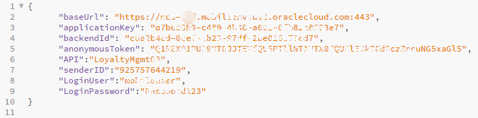

4. Cafe Supremo 모바일 앱을 사용하면 QR 코드를 스캔하여 새로운 설정을 읽을 수 있습니다. &quot;Mobile_App_Settings_Sample.json&quot;파일의 설정으로 QR 코드를 생성하고 모바일 앱에서 QR 코드를 스캔합니다. 

5. 웹 브라우저에서`http://www.qr-code-generator.com/`로 가서 `텍스트`버튼을 클릭하면 **자유 텍스트** 텍스트 영역이 나타납니다. 

6. &quot;Mobile_App_Settings_Sample.json&quot;파일의 설정을 복사하여 **free text** 영역에 붙여넣고 QR 코드 만들기 버튼을 클릭하십시오. 창의 오른쪽에 QR 코드 이미지가 생성됩니다. 
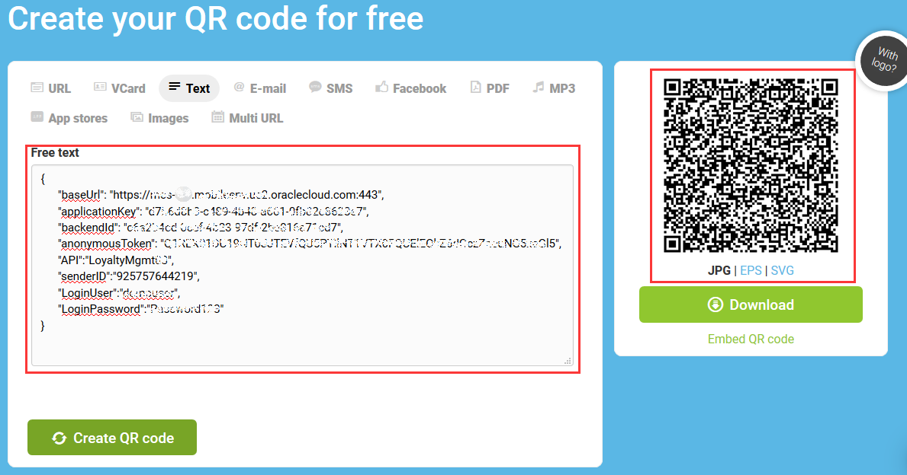

7. 휴대 기기에서 `Cafe Supremo`앱을 엽니다. 

 

8. **로그인하지 마십시오.** 왼쪽 상단 모서리에있는 햄버거 메뉴를 클릭하고 &quot;설정&quot;을 클릭하십시오. 

 

9. 설정 페이지가 열리면 가운데에있는 QRCode에서 설정 읽기 버튼을 클릭하십시오. 

 

10. QR 스캐너가 실행 중일 때 6 단계에서 작성한 QR 코드 이미지를 향해 모바일 장치를 향하게하십시오. 스캐너 카메라가 QR 이미지를 인식 할 때까지 모바일 장치와 화면 사이의 거리를 조정해야 할 수 있습니다. 

 

11. 성공적인 QR 코드 스캔에서 JSON 파일의 모든 설정이 아래와 같이 모바일 앱 설정 페이지에 자동으로 채워집니다. `Save settings and logout` 버튼을 클릭하십시오. 그런 다음 홈 화면으로 돌아갑니다. 

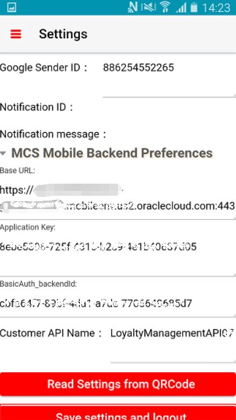 

12. 로그인 양식의 &quot;Username&quot;과 &quot;Password&quot;는 JSON 파일의 설정으로 미리 채워져 있습니다. 사용자 이름과 암호가 맞으면 `로그인`버튼을 클릭하여 로그인하십시오. 그렇지 않으면 수동으로 사용자 이름과 암호를 입력 할 수 있습니다. 

 

13. 로그인이 완료되면 시작 페이지가 표시됩니다. 휴대 기기에서 캠페인 쿠폰에 대한 푸시 알림을받을 준비가되었습니다. 

 

---
#### 테스트 알림 
1. 모바일 백엔드에서 &quot;알림&quot;탭으로 전환하고 &quot;4 테스트&quot;아래의 아이콘을 클릭하십시오. 

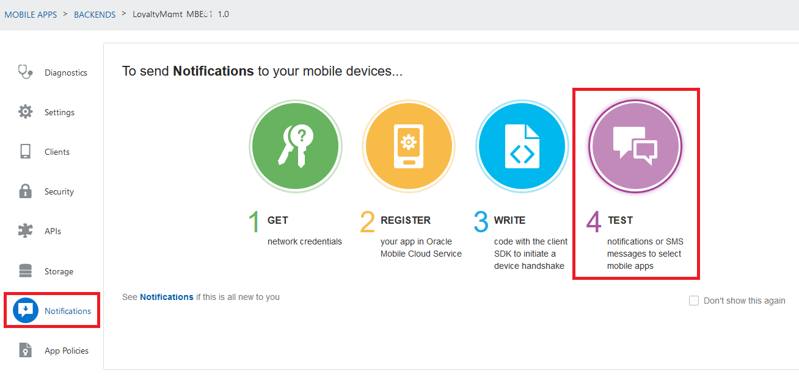 

2. &quot;장치 관리&quot;를 클릭하십시오. 

 

3. 이 모바일 백엔드에 등록 된 장치를 확인해야합니다. &quot;닫기&quot;를 클릭하고 &quot;테스트&quot;화면으로 돌아갑니다. 

 

4. 알림을 보내기 전에 Android 스마트 폰의 **배경 화면**에서 &quot;Cafe Supremo&quot;모바일 앱이 실행되고 있는지 확인하십시오. 

5. `포인트를 사용하여 제품을 구입할 수 있습니다! - 10001`로 알림 내용을 입력하세요. 보내기 옵션을 'Now'로 선택하고 &quot;보내기&quot;를 클릭하십시오. 아직 등록 된 기기가 없으면 오류가 발생합니다. 

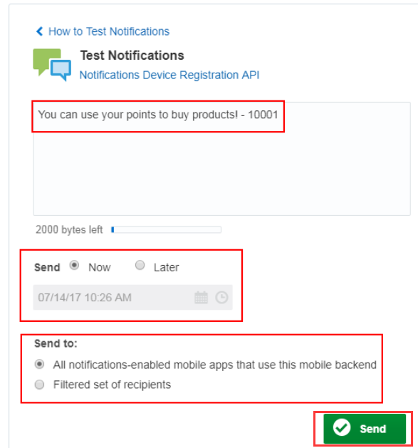 

6. 하나 이상의 장치가 등록되어 있으면 페이지 상단에 성공 메시지 팝업이 표시되고 장치의 알림 영역에 알림이 표시됩니다. 

 

 

[Procced to Next - 404: Track customer behaviors (Optional)](404-MobileLab.md) 

또는 

[Back to Mobile Service and Application Home](README.md) 

