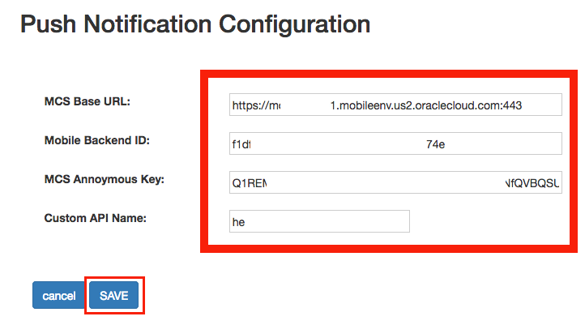

# 오라클 클라우드 테스트 드라이브 #
-----
## 501 : JEE 응용 프로그램에서 모바일 클라우드 서비스로 푸시 알림 전송을 위한 세팅 변경 ##


### 소개 ###
랩 4 - 모바일 서비스 및 앱 완료시 Android 기기에서 `Cafe Supremo`앱을 실행하고 필요한 모든 모바일 백엔드 서비스를 구성 할 수 있어야 합니다. Cafe Supremo 앱을 사용하는 고객은 로그온 하여 맞춤 프로모션 및 메뉴를 탐색 할 수 있습니다. 
고객이 정기적으로 최신의 새로운 프로모션 코드를 확인 하게 하는 대신 회사는 고객에게 적극적으로 알리고 싶어합니다. 마케팅 관리자가 새로운 쿠폰을 만들면 이미 `Cafe Supremo`앱을 설치 한 사용자에게 앱 기반 푸시 알림이 전송됩니다. 그래서 로열티 관리 JEE 애플리케이션을 메시징 알림 API를 호출하여 모바일 클라우드 서비스 (MCS)에 연결해야 합니다. 


### 오늘 Practice에 대하여 ###
이 연습에서는 다음을 수행합니다. 
- JEE 응용 프로그램에서 Push notification 설정 수정
- JEE 응용 프로그램에서 모바일 기기로 푸시 알림을 보내기 위하여 MCS API 호출

### 선수 과목 ###

+ 이전의 4 가지 Lab 실습 모두 완료 : [Java Apps](../Java%20Apps/README.md), [Microservices](../Microservices/README.md), [Integration](../Integrations/README.md) and [Mobile](Mobile%20Service%20and%20App/README.md) 


----


#### 푸시 알림을 수신하도록 모바일 장치 준비 

1. 이전 랩의 끝에서 By the end of previous lab [404: Set up Push Notification and Test Push Notification to mobile app](../Mobile Service and App/404-MobileLab.md), 아래처럼 MCS의 **Test Notifications** 을 통해 모바일 장치에서 알림 메시지 팝업을 수신 할 수 있어야 합니다. (lab exercise 404를 끝내지 못했는지 강사와 함께 확인 하십시오)


2. 모바일 앱을 실행하고 강사가 제공 한 **사용자 이름** 및 **비밀번호**를 입력 한 다음 `로그인`버튼을 클릭하십시오. 


3. 로그인이 완료되면 시작 페이지가 표시됩니다. 휴대 기기에서 캠페인 쿠폰에 대한 푸시 알림을 받을 준비가 되었습니다. 


#### Java 앱 푸시 알림 구성 수정 

1. 로열티 관리 응용 프로그램의 홈 페이지로 이동하십시오. 로열티 관리 애플리케이션 URL은 다음 형식이어야 합니다.
`https://**<JCS WLS instance IP Adress>**/loyalty/jsp/welcome.jsp`

페이지 하단의 [**푸시 알림 구성**] URL을 클릭하십시오. 


2. 환경에 따라 MCS 알림 설정을 업데이트하십시오. 이전에 Lab 404의 2 단계에서 준비한 Mobile_App_Settings_Sample.json에서 값을 사용할 수 있습니다. 
    - MCS Base URL: `your MCS baseUrl, https://{your-mcs-instance}.mobileenv.us2.oraclecloud.com:443`
    - Mobile Backend ID: `backendId in the json file`    
    - MCS Anonymous Key: `anonymousToken in the json file`    
    - Custom API Name: `API in the json file, LoyaltyMAnagementAPIXX`  

    당신의 json 파일은 이것과 비슷하게 보일 것입니다 - **물론 값은 다릅니다**
    ```json
    {
          "baseUrl": "https://<Your Mobile Cloud Service Identity Domain Name>.mobileenv.us2.oraclecloud.com:443",
          "applicationKey": "9722de7f-4ecf-443f-8e0e-714b2f6e0f9c",
          "backendId": "4a9d0d32-8aad-48fb-b803-5315459dce9f",
          "anonymousToken":  "R1NFMDAwMTE2NzhfTUNTX01PQklMRV9BTk9OWU1PVVNfQVBQSUQ6Smk3cXBld3lrczlfbmI=",
          "API":"LoyaltyManagementAPI0X",
          "senderID":"925757644219"
    }
    ```

    When Copy-n-Paste to the web form, be careful
      - do NOT add white space   
      - you copy and paste the **COMPLETE** value     
  Click [ **SAVE** ] button to save your new settings.



3. Once the Push Notification Settings are saved, you can proceed to next lab.


Your Loyalty Management JEE Application is now ready to create campaign offer and notify customer mobile device.

You have finished this lab section.

[Procced to Next - 502: End-to-End Testing](502-PuttingAllTogetherLab.md)

or

[Back to Putting All Together Lab Home](README.md)

